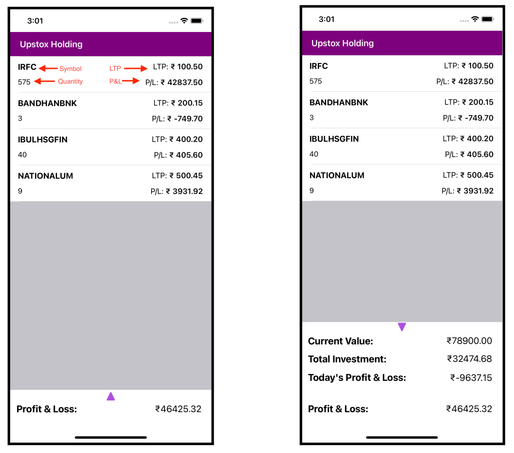

# upstox-assignment-ayush

## Demo

### iOS

https://github.com/gupta-ji6/upstox-assignment-ayush/assets/21218732/6c338d37-f50d-43d0-bc4a-416dd0da9be0

### Android

https://github.com/gupta-ji6/upstox-assignment-ayush/assets/21218732/a39493b6-fd67-4fb8-af50-8aae0d896904

## Problem Statement

1. Create a list of holdings (stocks invested) and populate the list as per the below screenshots.
2. Create an expanded & collapsed state UI for showing the summary of your portfolio.
3. Endpoint to fetch data: https://run.mocky.io/v3/bde7230e-bc91-43bc-901d-c79d008bddc8

### Points to be considered for evaluation

1. Responsibility segregation in modules

### Field details

1. Symbol => Use from JSON response
2. Quantity => Use from JSON response
3. LTP => Use from JSON response
4. P&L = Current value (Individual item) (minus) Investment value (Individual
item)
5. Current value (Individual item) = LTP * Quantity
6. Investment value (Individual item) = Avg. Price * Quantity
7. Current value total = sum of all the Current values
8. Total investment = sum of all the Investment values
9. Total PNL = Current value total - Total Investment
10.Today’s PNL = sum of ((Close - LTP ) * quantity) of all the holdings